# Desafio Practico # 3 <br>


<br>
<h1> Comenzando</h1> 
Un sistema con base de datos que esta con arquitectura MVC para PHP nativo y tambien implementado en laravel con estilos
<br>
<h2>Prerequisistos</h2>

- Node.js
- Git
- Php
- Composer
- Gestor de paquetes npm
- Mysql

> [!IMPORTANT]
> Importar la base de datos que esta database con el nombre de script.sql

## Instalacion de dependencias
### Linux

#### debian/ubuntu
```
sudo apt install php git npm composer 
```
#### Arch
```
sudo pacman -S php git npm composer
```
## Windows

#### Git 
 Descarga e instala el ejecutable desde la página oficial de Git

#### Node.js y npm
 Descarga el instalador LTS desde la web oficial de Node.js. Este instalará npm automáticamente.

#### PHP 
 La forma más común y automatizada para desarrollo en Windows es descargar entornos preparados como XAMPP o Laragon, los cuales configuran PHP al instante.

#### Composer 
 Una vez que tengas PHP funcionando, descarga y ejecuta el instalador automático Composer-Setup.exe. El asistente detectará tu ruta de PHP automáticamente.

## En macOS
#### Instalar PHP, Git y Node.js (que ya incluye npm)
```
brew install php git nodejs
```
#### Instalar Composer
```
brew install composer
```
## Instalacion

Clonar repositorio
```
git clone https://github.com/fR4nkl41/DataAuditLabs.git
```
Entra al directorio 
```
cd DataAuditLabs
```
## MVC nativo de PHP

Entra al directorio 
```
cd mvc_nativo
```
> [!IMPORTANT]
> Configurar archivo de configuracion de config/config.php y editar con las credenciales de su base de datos 

iniciar proyecto
```
 php -S localhost:8080
```
## MVC laravel

 Entrar al directorio
```
cd laravel_tareas
```

Configurar variable de entorno

copia .env.example .env
```
cp .env.example .env
```
> [!IMPORTANT]
> editar .env hasta llegar a DB_CONNECTION=mysql donde pondras las credenciales de tu base de datos mysql

instalar dependencias de node 
```
npm install
```
ejecutar para estilos
```
npm run build 
```
ejecutar composer para dependencias de php
```
composer update
```
nota 
tienes que generar key para laravel para poder ejecutar el proyecto 
```
php artisan key:generate
```
ejecutar para base de datos
```
php artisan migrate
```
iniciar proyecto
```
php artisan serve
```
con la url que te dio entra al proyecto desde tu navegador de confianza 


##  Uso de inteligencia Artificial<br>
<br>

>Para el desarrollo del proyecto usamos la inteligencia artificial en forma de guia y manejo de errores para el apartado de mvc y una forma rapida para explicar como inmigrar el codigo de php puro al framework de laravel ya de ahi lo que me explico la inteligencia artifial pudimos tener una idea de como desarrollar la aplicacion.

## Imagenes del proyecto

### Login
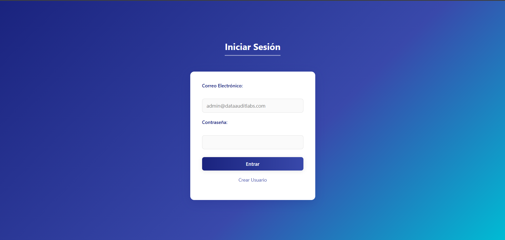

### Registro 
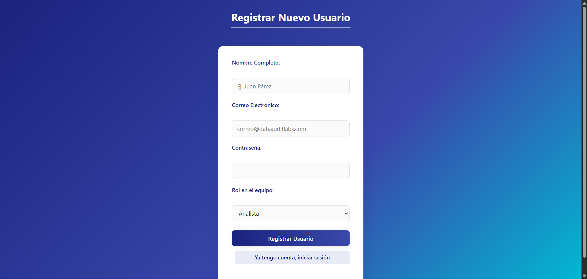

### Index
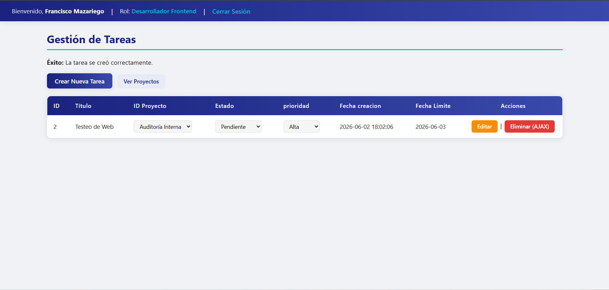

### Crear Tarea
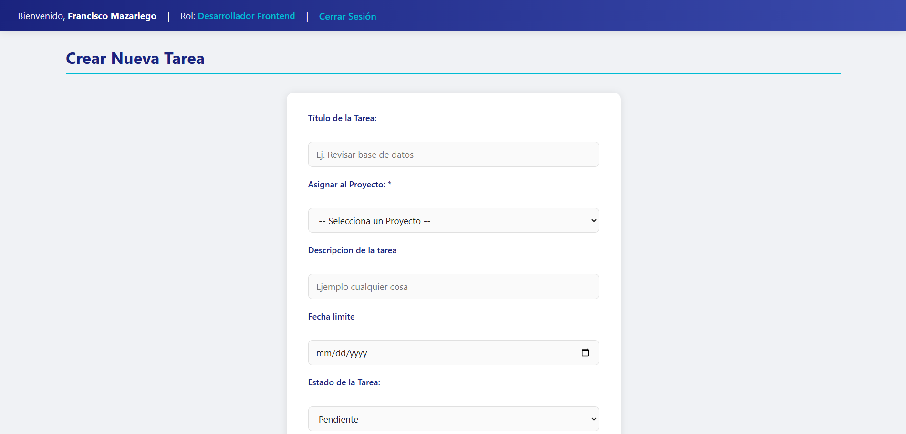


### Editar Tarea
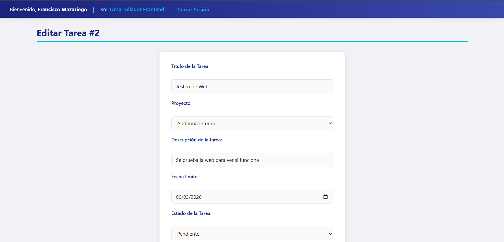
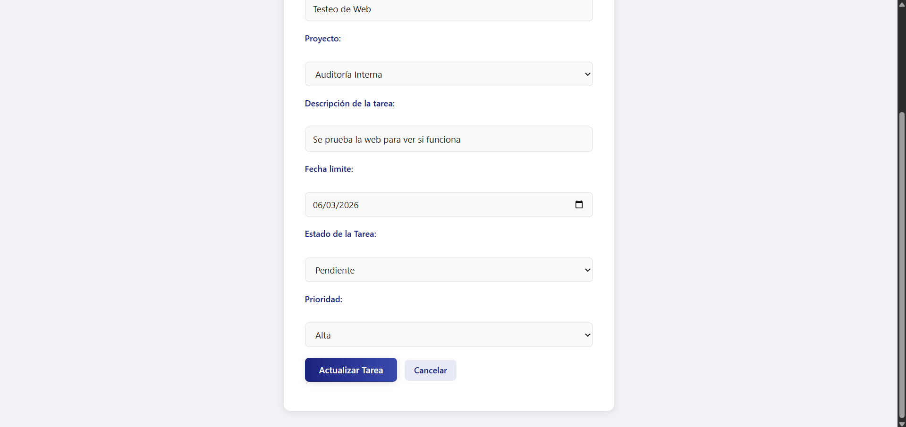

### Proyectos
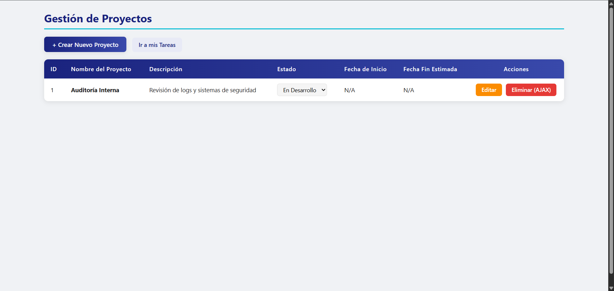

### Crear Proyecto
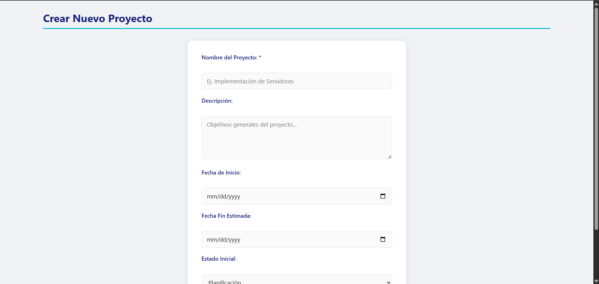
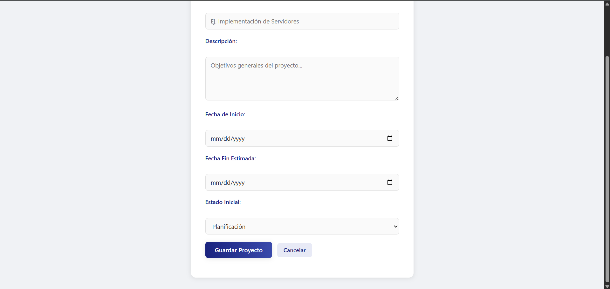

### Edicion Proyecto
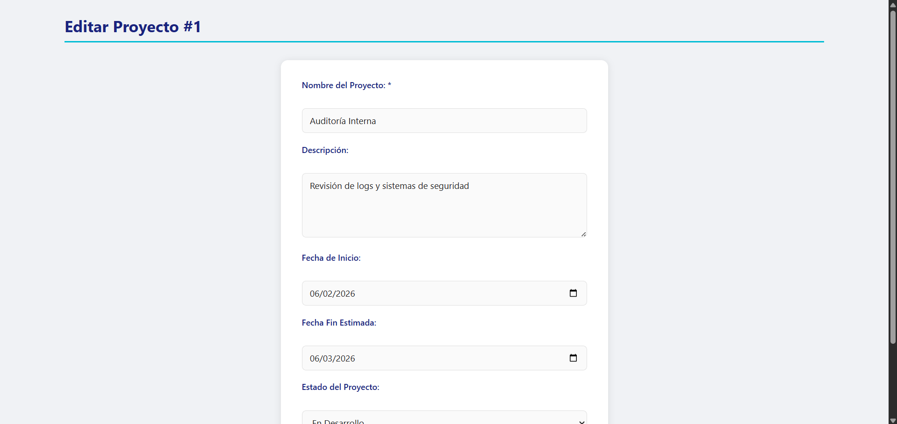
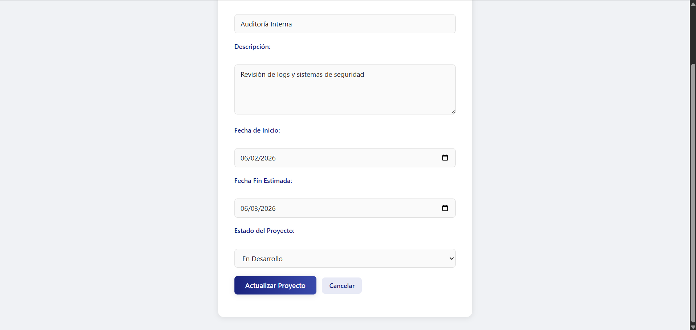